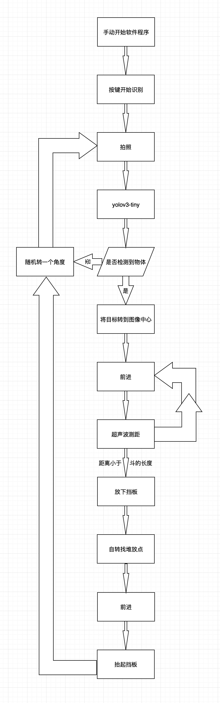

# 垃圾分类小车

[TOC]


## 1. 流程图




## 2. Requirements 

- Raspberry Pi 4B, 4GB
- Python 3.7.3
- Opencv 3.4.6
- numpy 1.16.2


## 3. Modules

### BasicMovement.py

```python
# Set up method
PWMA = 18
AIN1 = 22
AIN2 = 27

PWMB = 23
BIN1 = 25
BIN2 = 24

GPIO.setwarnings(False) 
GPIO.setmode(GPIO.BCM)
GPIO.setup(AIN2,GPIO.OUT)
GPIO.setup(AIN1,GPIO.OUT)
GPIO.setup(PWMA,GPIO.OUT)

GPIO.setup(BIN1,GPIO.OUT)
GPIO.setup(BIN2,GPIO.OUT)
GPIO.setup(PWMB,GPIO.OUT)

L_Motor = GPIO.PWM(PWMA,100)
L_Motor.start(0)

R_Motor = GPIO.PWM(PWMB,100)
R_Motor.start(0)
```

```python
# Turn right
def turn_right(degree, L_Motor, R_Motor)
```

```python
# Turn left
def turn_left(degree, L_Motor, R_Motor)
```

```python
# Go forward
def speed_forward(init_speed, final_speed, accelerate_time, L_Motor, R_Motor, show=True)
# Smooth accelerate from init_speed to final_speed
# if (init_speed==0) and (final_speed==0), stand still
```

```python
# Go backward
def speed_backward(init_speed, final_speed, accelerate_time, L_Motor, R_Motor, show=True)
# Smooth accelerate from init_speed to final_speed
# if (init_speed==0) and (final_speed==0), stand still
```

```python
''' WARNING '''
1. Speed Limitation ∈ (20,80)
2. Speed under 20, wheels may not move
3. Speed beyond 80, I am afraid the current may be too large
```

### Button.py

```python
# Set up method
BtnPin = 19
Gpin = 5
Rpin = 6

GPIO.setwarnings(False)
GPIO.setmode(GPIO.BCM)
GPIO.setup(Gpin, GPIO.OUT)
GPIO.setup(Rpin, GPIO.OUT)
GPIO.setup(BtnPin, GPIO.IN, pull_up_down=GPIO.PUD_UP)
```

```python
# Usage
try:
    while True:
        if GPIO.input(BtnPin) == True:
            time.sleep(0.01)
            if GPIO.input(BtnPin) == True:
                GPIO.output(Rpin,GPIO.HIGH)
                GPIO.output(Gpin,GPIO.LOW)
        elif GPIO.input(BtnPin) == False:
            time.sleep(0.01)
            if  GPIO.input(BtnPin) == False:
                while GPIO.input(BtnPin) == True:
                    pass
                GPIO.output(Rpin,GPIO.LOW)
                GPIO.output(Gpin,GPIO.HIGH)
except KeyboardInterrupt:
    GPIO.cleanup()
```

### Camera.py

```python
# Set up method
import picamera
# Take a picture
camera = picamera.PiCamera()
camera.capture('example.jpg')
# Record a video
camera.start_recording('example.h264')
time.sleep(5)
camera.stop_recording()
```

### Music for Fun

#### Music.py

```python
# For Buzzer Singing
'''
format:
music = {
    'notes':[],
    'duration':[]
    }
'''
Castle_in_the_sky = {
    'notes':[...],
    'duration':[...]
    }
Canon = {
    'notes':[...],
    'duration':[...]
    }
Windows = {
    'notes':[...],
    'duration':[...]
    }
```

#### Play.py

```python
# Play music via buzzer
# Set up method
buzzer = 17
GPIO.setmode(GPIO.BCM)
GPIO.setup(buzzer, GPIO.OUT)
```

#### utils.py

```python
# Utilities for playing music
# Get frequency from note
def get_freq(note, tone='C'):
    # ...
    return frequency # Hz
```

```python
# Biii~~~
def biii(frequency, duration)
```

```python
# Play music, music is defined in `Music.py`
def play_music(music, std_time)
```

### Servo.py

```python
# Set up method
def setup_servo():
    # ...
    return info
```

```python
# Initialization
def ServoInit(info):
    # ...
    return info
```

```python
# Usage
''' 0.1˚ per call'''
# 1. Bottom left & right
def BottomLeft(info):
    # ...
    return info
def BottomRight(info):
    # ...
    return info
# 2. Arm A up & down
def Arm_A_Up(info):
    # ...
    return info
def Arm_A_Down(info):
    # ...
    return info
# 3. Arm B up & down
def Arm_B_Up(info):
    # ...
    return info
def Arm_B_Down(info):
    # ...
    return info
# 4. Servo stop
def Servo_stop(info):
    # ...
    return info
```

```python
''' WARNING '''
# Always return `info` for updating parameters
# May get ERROR sometimes, MAGIC!
```

### Ultrasonics.py

```python
# Set up method
ECHO = 19
TRIG = 17

GPIO.setwarnings(False)
GPIO.setmode(GPIO.BCM)
GPIO.setup(ECHO, GPIO.IN)
GPIO.setup(TRIG, GPIO.OUT)
```

```python
# Measurements 
def biu():
    # ...
    return distance # in mm
```

```python
''' WARNING '''
# An interval time is needed, use `time.sleep(0.1)`
# ECHO pin is also used in Button, but it is okay
# TRIG pin is also used in Buzzer, it is fine but every time `biu`, there will be a click sound
```

### yolo_cmdline.py

```python
def yolo_detect(params):
    # ...
    return label, confidence, x, y

''' content of `params` '''
# params['image'] => input image file, e.g. `items.jpg`
# params['names'] => `.names` file, e.g. '/home/pi/darknet-nnpack/data/trash25.names'
# params['config'] => `.cfg` file, e.g. '/home/pi/darknet-nnpack/cfg/yolov3-trash25.cfg'
# params['weights'] => `.weights` file, e.g. '/home/pi/darknet-nnpack/yolov3-trash25.weights'
# params['confidence'] => confidence threshold
# params['num'] => target number threshold, for Non Maximum Suppression

''' return arguments '''
# label => class of classification
# confidence => probability
# x, y => target center coordinate
# if nothing detected, return `None, None, None, None`
```

